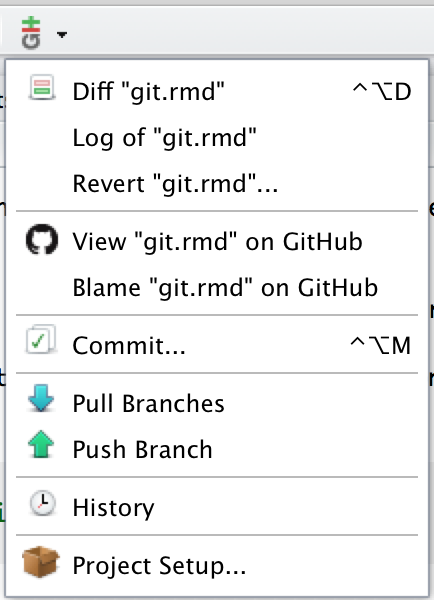
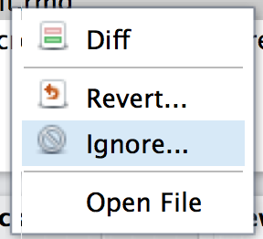

# Git and GitHub {#git}

Si se toma en serio el desarrollo de software, debe aprender sobre Git. Git es un _sistema de control de versiones_, una herramienta que rastrea los cambios en su código y comparte esos cambios con otros. Git es más útil cuando se combina con [GitHub](http://github.com), un sitio web que le permite compartir su código con el mundo, solicitar mejoras a través de pull requests (solicitudes de extracción) y seguir issues (problemas). Git + GitHub es el sistema de control de versiones más popular para desarrolladores de paquetes de R (lo atestiguan los miles de paquetes de R alojados en GitHub).

Git y GitHub son generalmente útiles para todo el desarrollo de software y análisis de datos, no solo para paquetes de R. Se ha incluido aquí, porque es muy útil cuando se hace un paquete. No hay forma de que uno pueda ser tan productivo sin Git y GitHub a la espalda, lo que permite detectar errores rápidamente y colaborar fácilmente con otros.

¿Por qué Git + GitHub?

  * Hace que compartir su paquete sea fácil. Cualquier usuario de R puede instalar su paquete con solo dos líneas de código:
    
    ```{r, eval = FALSE}
    install.packages("devtools")
    devtools::install_github("username/packagename")
    ```
    
  * GitHub es una excelente manera de crear un sitio web para su paquete. Los lectores pueden navegar fácilmente por el código y leer la documentación (a través de Markdown). Pueden informar errores, sugerir nuevas funciones con [GitHub issues][gh-issues] y proponer mejoras a su código con pull requests. 
    
  * ¿Alguna vez ha intentado escribir códigos de forma colaborativa con alguien enviando archivos de un lado a otro por correo electrónico o en una carpeta de Dropbox? Se necesita un gran esfuerzo para asegurarse de que esas dos personas no estén trabajando en el mismo archivo y sobrescriban los cambios de los demás. Con Git, ambos pueden trabajar en el mismo archivo al mismo tiempo. Git combinará sus cambios automáticamente o le mostrará todas las ambigüedades y conflictos.

  * ¿Alguna vez presionó `s` en lugar de Cmd + S para guardar su archivo? Es muy fácil introducir accidentalmente un error que tarda unos minutos en rastrear. Git hace que este problema sea fácil de detectar porque le permite ver exactamente qué ha cambiado y deshacer cualquier error.

Usted puede hacer muchas de estas mismas cosas con otras herramientas (como [subversion](https://subversion.apache.org) o [mercurial](http://mercurial.selenic.com)) y otros sitios web (como [gitlab](https://about.gitlab.com) y [bitbucket](https://bitbucket.org)). Git es muy útil junto con GitHub y viceversa, así que no vale la pena hacer ningún esfuerzo por distinguir entre las características que pertenecen a Git y las que pertenecen a GitHub. Sin embargo Git + GitHub es el sistema más fácil de usar (especialmente para los nuevos desarrolladores), sobre todo porque su popularidad significa que la respuesta o solución a cada posible pregunta o problema se puede encontrar en StackOverflow. 

Esto no quiere decir que Git sea fácil de aprender. Es probable que sus experiencias iniciales con Git sean frustrantes y con frecuencia maldecirá la terminología extraña y los mensajes de error inútiles. Afortunadamente, hay muchos tutoriales disponibles en línea, y aunque no siempre están bien escritos (muchos brindan mucha información, pero poca orientación sobre qué hacer con ella o por qué debe importar), puede dominar absolutamente a Git con un poco de práctica. No se rinda! Persevere y desbloqueará la superpotencia de la colaboración de código.

## RStudio, Git y GitHub {#git-rstudio}

RStudio simplifica el uso diario de Git. Una vez que haya configurado un proyecto para usar Git, verá un nuevo ícono de panel y barra de herramientas. Estos proporcionan accesos directos a los comandos Git más comúnmente utilizados. Sin embargo, debido a que solo hay un puñado de los más de 150 comandos de Git disponibles en RStudio, también debe estar familiarizado con el uso de Git desde __shell__ (también conocido como la línea de comandos o la consola). También es útil estar familiarizado con el uso de Git en un shell porque si se queda atascado necesitará buscar una solución con los nombres de los comandos de Git.

La forma más fácil de acceder a un shell desde RStudio es Herramientas > Shell. Esto abrirá un nuevo shell ubicado en el directorio raíz de su proyecto. (NB: en Windows, esto abre un _bash_ shell, el shell estándar de Linux, que se comporta de forma un poco diferente del shell `cmd.exe` usual).

No se preocupe si nunca antes ha usado el shell porque es muy similar al uso de R. La principal diferencia es que en lugar de funciones, llama a comandos, que tienen una sintaxis ligeramente diferente. Por ejemplo, en R puede escribir `f(x, y = 1)`, donde en el intérprete de comandos escribiría `f x --y=1` o `f x -y1`. Además, aunque los comandos de shell son incluso menos regulares que las funciones de R, afortunadamente solo necesita estar familiarizado con algunos. En este capítulo, no hará mucho en el shell además de ejecutar los comandos de Git. Sin embargo, es una buena idea aprender los tres comandos de shell más importantes:

* `pwd`: print working directory. Esto le dice en qué directorio está actualmente.
* `cd <name>`: change directory. Use `cd ..` para subir al directorio anterior en jerarquía.
* `ls`: list files. Muestra todos los archivos en el directorio actual.

Si nunca ha usado el shell antes, le recomiendo usar [Terminus](http://web.mit.edu/mprat/Public/web/Terminus/Web/main.html). Es una forma divertida de aprender los conceptos básicos de shell. También se recomienda echar un vistazo a los videos de Philip Guo [Basic Unix-like command line tutorial](http://pgbovine.net/command-line-tutorial.htm), y en <http://www.ee.surrey.ac.uk/Teaching/Unix/unix1.html> y <https://p1k3.com/userland-book/>.

## Configuración inicial {#git-init}

Si nunca antes ha usado Git o GitHub, comience instalando Git y creando una cuenta de GitHub. Luego, una los dos:

1.  Instalar Git:

    * Windows: <http://git-scm.com/download/win>.
    * OS X: <http://git-scm.com/download/mac>.
    * Debian/Ubuntu: `sudo apt-get install git-core`.
    * Otras distros de Linux: <http://git-scm.com/download/linux>.

1.  Dígale a Git su nombre y dirección de correo electrónico. Estos se utilizan para etiquetar cada commit para que cuando comience a colaborar con otros, quede claro quién hizo cada cambio. En el shell, ejecute:

    ```bash
    git config --global user.name "YOUR FULL NAME"
    git config --global user.email "YOUR EMAIL ADDRESS"
    ```

    (Puede verificar si está configurado correctamente ejecutando 
    `git config --global --list`.)

1.  Cree una cuenta en GitHub, <https://github.com> (el plan gratuito está bien). 
    Use la misma dirección de correo electrónico que usó arriba.
    
1.  Si es necesario, genere una clave SSH. Las claves SSH le permiten comunicarse de forma segura con sitios web sin una contraseña. Hay dos partes para una clave SSH: una pública y una privada. Las personas con su clave pública pueden cifrar de forma segura los datos que solo pueden leer personas con su clave privada.
    
    Puede verificar si ya tiene un par de claves SSH ejecutando:
    
    ```{r, eval = FALSE}
    file.exists("~/.ssh/id_rsa.pub")
    ```

    Si eso devuelve `FALSE`, necesitará crear una nueva clave. Puede seguir las [instrucciones en GitHub](https://help.github.com/articles/generating-ssh-keys) o use RStudio. Vaya a las preferencias de RStudio, elija el panel Git/SVN y haga clic en "Create RSA key...":
    

    
1.  Déle a GitHub su clave pública SSH: <https://github.com/settings/ssh>. La forma más fácil de encontrar la clave es hacer clic en "View public key" en el panel de preferencias de Git/SVN de RStudio.

## Cree un repositorio local en Git {#git-init}

¡Ahora que ha instalado y configurado Git, puede usarlo! Para usar GitHub con su paquete, necesitará inicializar un repositorio local, o __repo__ para abreviar. Esto crea un directorio `.git` que almacena archivos de configuración y una base de datos que registra los cambios en su código. Un nuevo repositorio solo existe en su computadora; aprenderá cómo compartirlo con otros en breve.

Para crear un nuevo repo:

  * En RStudio, vaya a las opciones de proyecto, luego al panel Git/SVN. Cambie el
    "Version control system" de "None" a "Git":
    
    
    
    Se le pedirá que reinicie RStudio.

  * En un shell, ejecute `git init`. Reinicie RStudio y vuelva a abrir su paquete.

Una vez que Git se haya inicializado, verá dos nuevos componentes:

  * El __git pane__, en la esquina superior derecha, le muestra qué archivos han cambiado e incluye botones para los comandos más importantes de Git:
  
  

  * El menú __git dropdown__, que se encuentra en la barra de herramientas, incluye los comandos de Git y GitHub que se aplican al archivo actual:
  
  

## Revise lo que cambió {#git-status}

El primer beneficio de Git es que puede ver fácilmente los cambios que ha realizado. Esto es realmente útil, ya que a menudo accidentalmente se escriben mal los atajos de teclado, dejando caracteres extraviados en el código. El panel de RStudio Git enumera cada archivo que se ha agregado, modificado o eliminado. El ícono describe el cambio:

*  __Modified__. Ha cambiado los contenidos del archivo.

*  __Untracked__. Ha agregado un nuevo archivo que Git no había visto antes.

*  __Deleted__. Ha eliminado un archivo.

Puede obtener más detalles sobre modificaciones con un "diff", . Esto abra una nueva ventana mostrando las **diff**erencias detalladas:


Los colores de fondo le indican si el texto se ha agregado (verde) o eliminado (rojo). (Si es daltónico, puede usar los números de línea en las dos columnas de la izquierda como guía: un número en la primera columna identifica la versión anterior, un número en la segunda columna identifica la nueva versión). Las líneas grises de el código de arriba y abajo de los cambios le da contexto adicional.

En el shell, use `git status` para echar un vistazo a los cambios y `git diff` para mostrar diferencias detalladas.  

## Grabar los cambios {#git-commit}

La unidad de trabajo fundamental en Git es un __commit__. Un commit toma una instantánea de su código en un punto específico en el tiempo. Usar un commit de Git es como usar anclajes y otras protecciones al escalar. Si cruza una cara de roca peligrosa, debe asegurarse de haber usado protección para atraparse si se cae. Los commits juegan un papel similar: si comete un error, no puede dejar atrás el commit anterior. Escribir código sin hacer commits es como escalar libremente: puede viajar mucho más rápido a corto plazo, pero a largo plazo las posibilidades de una falla catastrófica son altas. Al igual que la protección de escalada, debe ser juicioso en el uso de los commits. Hacer commits con demasiada frecuencia disminuirá su progreso; use más commits cuando esté en territorio incierto o peligroso. Los commits también son útiles para otros, porque muestran su viaje, no solo el destino.

Hay cinco componentes principales para cada commit:

* Un identificador único, llamado SHA (abreviatura de secure hash algorithm (algoritmo de hash seguro).

* Un conjunto de cambios que describe qué archivos se agregaron, modificaron y eliminaron.

* Un mensaje de commit legible para humanos.

* Un familiar, el commit que vino antes de este. (Hay dos excepciones a esta regla: el commit inicial no tiene un familiar, y los merges (fusiones), de las que aprenderá más adelante, tienen dos familiares).

* Un autor.

Usted crea un commit en dos etapas:

1.  Le hace __stage__ a sus archivos, diciéndole a Git qué cambios deberían incluirse en el siguiente commit. 
  
1.  Le hace __commit__ a los archivos a los que les hizo staged, describiendo los cambios con un mensaje.

En RStudio, el staging y el commit se realizan en el mismo lugar, la ventana de confirmación, que puede abrir haciendo clic en  o presionando Ctrl + Alt + m.


La ventana de confirmación se compone de tres paneles:

* El panel superior izquierdo muestra el estado actual en el medio del panel de Git en la ventana principal de RStudio. 

* El panel inferior muestra la diferencia del archivo seleccionado actualmente.

* El panel superior derecho es donde ingresará el mensaje de confirmación, un mensaje legible por humanos que resume los cambios realizados en el commit. Más sobre eso en breve.

(Sí, esta es exactamente la misma ventana que ve cuando hace clic 

Para crear un nuevo commit:

1.  __Guarde sus cambios__.

1.  __Abra la ventana de commit__ haciendo click  en  o 
    presionando `Ctrl + Alt + m`.  

1.  __Seleccione archivos__.  Para preparar (seleccionar) un sólo archivo para su inclusión, marcque su cuadro de verficación. Para preparar todos los archivos, presione Ctrl/Cmd + A, luego haga click en. 
    
    A medida que prepare cada archivo, verá que su estado cambia. El ícono cambiará las columnas de la derecha (estado sin preparar) a la izquierda (estado preparado), y es posible que vea uno de dos íconos nuevos: 

      * Added: : 
        después de preparar un archivo sin seguimiento, Git ahora sabe que desea agregarlo al repositorio.
      
      * Renamed: :
        Si cambia el nombre de un archivo, Git inicialmente lo ve como una eliminación y adición. Una vez que realice los dos cambios, Git reconocerá que se trata de un cambio de nombre. 
        
    A veces verá estados en ambas columnas, e.g. .
    Esto significa que tiene cambios preparados y no preparados en el mismo archivo. Esto sucede cuando ha realizado algunos cambios, los ha preparado y luego ha realizado algunos más. Al hacer clic en la casilla de verificación se prepararán los nuevos cambios, al hacer clic de nuevo se eliminarán ambos conjuntos de cambios.

1.  __Archivos preparados__, como está arriba.

1.  __Escriba un mensaje de confirmación__ (panel superior derecho) que describe los cambios que ha realizado. La primera línea de un mensaje de confirmación se llama línea de asunto y debe ser breve (50 caracteres o menos). Para commits complicados, puede seguirlo con una línea en blanco y luego un párrafo o una lista con viñetas que proporcione más detalles. Escriba mensajes de manera imperativa, como decirle a alguien qué hacer: "corregir este error", no "solucionó este error" o "este error fue reparado".
    
1.  __Click Commit__.

Los archivos preparados son un poco más complicados en el shell. Utilice `git add` para crear archivos nuevos y modificados, y `git rm` para preparar los archivos eliminados. Para crear el commit, use `git commit -m <message>`.

## Buenas prácticas de Commit {#commit-best-practices}

Idealmente, cada commit debería ser _mínima_ pero _completa_:

* __Minima__: Un commit solo debe contener cambios relacionados con un único problema. Esto hará que sea más fácil entender el commit de un vistazo y describirlo con un simple mensaje. Si descubre un nuevo problema, debe hacer un commit por separado.

* __Completa__: Un commit debería resolver el problema que afirma resolver. Si cree que ha solucionado un error, el commit debe contener una prueba unitaria que confirme que tiene razón.

Cada commit debería:

* __Sea conciso, pero sugestivo__. A simple vista, debería poder ver lo que hace un commit. Pero debe haber suficientes detalles para que pueda recordar (y comprender) lo que se hizo.

* __Describa el porqué, no el qué__. Como siempre puede recuperar la diferencia asociada a un commit, el mensaje no necesita decir exactamente qué cambió. En su lugar, debe proporcionar un resumen de alto nivel que se centre en las razones del cambio.

Si hace esto:

* Será más fácil trabajar con otros. Por ejemplo, si dos personas han cambiado el mismo archivo en el mismo lugar, será más fácil resolver conflictos si los commits son pequeños y está claro por qué se hizo cada cambio.
  
* Los recién llegados al proyecto pueden entender más fácilmente el historial leyendo los registros de confirmación.
  
* Puede cargar y ejecutar su paquete en cualquier punto de su historial de desarrollo. Esto puede ser tremendamente útil con herramientas como [bisectr](https://github.com/wch/bisectr), que le permiten usar la búsqueda binaria para encontrar rápidamente el commit que introdujo un error.

* Si puede averiguar exactamente cuándo se introdujo un error, puede comprender fácilmente lo que estaba haciendo (¡y por qué!).

Usted podría pensar que debido a que nadie más revisará su repositorio,  no vale la pena escribir buenos mensajes de confirmación. Pero tenga en cuenta que tiene un colaborador muy importante futuro: ¡usted! Si dedica un poco de tiempo a pulir sus mensajes de confirmación, su futuro-usted, le agradecerá si necesita realizar una autopsia en un error.

Recuerde que estas directivas son aspiracionales. No debería dejar que se interpongan en su camino. Si mira el historial de confirmaciones de los repositorios, notará que muchos de ellos no son tan buenos, especialmente cuando empiece a sentirse frustrado por el hecho de que __todavía_ no logra arreglar un error. Esfuércese por seguir estas pautas, y recuerde que es mejor tener múltiples commits incorrectos que tener un commit perfecto.

## Ignorar archivos {#git-ignore}

A menudo, hay archivos que no desea incluir en el repositorio. Pueden ser transitorios (como archivos de construcción LaTeX o C), muy grandes o generados a pedido. En lugar de cuidadosamente _no_ prepararlos cada vez que se va a hacer commit, debería agregarlos a `.gitignore`. Esto evitará que se agreguen accidentalmente. La forma más sencilla de hacer esto es hacer clic derecho en el archivo en el panel de Git y seleccionar `Ignorar`:




Si usted quiere ignorar múltiples archivos, puede usar un comodín "glob" como `*.png`. Para aprender más acerca de las opciones, vea [ignoring files](http://git-scm.com/book/ch2-2.html#Ignoring-Files) en Pro-Git.

Algunos desarrolladores nunca hacen commit a archivos derivados, o archivos que pueden generarse automáticamente. Para un paquete en R esto significaría ignorar los archivos en los directorios `NAMESPACE` y `man/` porque se generan a partir de comentarios. Desde una perspectiva práctica, es mejor hacer commit a estos archivos: los paquetes en R no tienen forma de generar archivos `.Rd` en la instalación, por lo que ignorar los archivos derivados significa que los usuarios que instalen su paquete en GitHub no tendrán documentación.

## Deshacer un error {#git-undo}

Lo mejor de usar commits es que puede deshacer los errores. RStudio lo hace particularmente fácil:

*   Para deshacer los cambios que acaba de hacer, haga clic derecho en el archivo en el panel de Git y seleccione "revert". Esto hará que los cambios vuelvan al commit. Cuidado: ¡no puede deshacer esta operación!
  
    Puede también deshacer cambios en solo una parte de un archivo en la ventana diff. Busque el botón __discard chunk__ encima del bloque de cambios que quiere deshacer:. También puede descartar cambios en líneas individuales o texto seleccionado.

*   Si hizo commit a cambios demasiado pronto, puede modificar el commit anterior configurando los cambios adicionales. Antes de hacer clic en commit, seleccione
. (No haga esto si ha enviado el commit anterior a GitHub; en realidad está reescribiendo el historial, lo cual debe hacerse con cuidado cuando lo hace en público).
  
Si no captó el error de inmediato, tendrá que mirar hacia atrás en la historia y descubrir dónde ocurrió:

1.  Abra la ventana del historial haciendo click  en el panel de Git.


    La ventana del historial está dividida en dos partes. La parte superior enumera cada commit con su repositorio. La parte inferior muestra el commit: el SHA (el ID único), el autor, la fecha, el responsable y los cambios en el commit.
     
1.  Navegue hacia atrás en el tiempo hasta que encuentre el commit donde ocurrió el error. Escriba el SHA: ese es el commit que ocurrió antes del error, así que será bueno.
    
Ahora puede usar ese SHA en el shell:

*   Vea cómo se veía el archivo en el pasado para poder copiar y pegar el código anterior:
    
    ```bash
    git show <SHA> <filename>
    ```

*   O copie la versión desde el pasado al presente:

    ```bash
    git checkout <SHA> <filename>
    ```
    
En ambos casos, tendrá que terminar organizando y haciendo commit a los archivos.

(También es posible utilizar Git como si retrocediera en el tiempo y evitar que se produjera el error. Esta es una técnica avanzada llamada __rebasing history__. Como puede imaginar, retroceder en el tiempo para cambiar el pasado puede tener una impacto profundo en el presente. Puede ser útil, pero debe hacerse con extremo cuidado).

Si aún así está atascado, pruebe <http://sethrobertson.github.io/GitFixUm/fixup.html> o <http://justinhileman.info/article/git-pretty/>. Allí se ofrecen enfoques paso a paso para solucionar muchos problemas comunes (¡y no tan comunes!).

## Sincronizándose con GitHub {#github-init}

Hasta ahora solo hemos estado trabajando localmente, usando commits para seguir el progreso de un proyecto y proporcionar puntos de control seguros. Sin embargo, Git realmente brilla cuando comienza a compartir su código con otros en [GitHub](http://github.com). Si bien hay otras opciones, se recomienda GitHub porque es gratis para proyectos de código abierto, tiene todas las características que necesitará y es una opción popular en el mundo de R.

Para publicar, o hacer __push__ de su código a GitHub:

1.  Cree un nuevo repo en GitHub: <https://github.com/new>. Dele el mismo nombre que su paquete e incluya el título del paquete como la descripción del repositorio. Deje todas las demás opciones como están, luego haga clic en Submit.

1.  Abra una ventana de shell, luego siga las instrucciones en la nueva página del repositorio. Se verán algo así:

    ```bash
    git remote add origin git@github.com:hadley/r-pkgs.git
    git push -u origin master
    ```
    
    La primera línea le dice a Git que su repositorio local tiene una versión remota en GitHub, y lo llama "origen". La segunda línea lleva todo su trabajo actual a ese repositorio.

Ahora hagamos un commit y verifiquemos las actualizaciones del repositorio remoto:

1.  Modifique la `DESCRIPTION` para agregar los campos `URL` y `BugReports` de ese enlace a su nuevo sitio GitHub. Por ejemplo, dplyr tiene:

    ```yaml
    URL: http://github.com/hadley/dplyr
    BugReports: http://github.com/hadley/dplyr/issues
    ```

1.  Guarde el archivo y haga un commit (con el mensaje "Actualizando DESCRIPTION para agregar enlaces al sitio de GitHub"). 
    
1.  Haga __Push__ de sus cambios a GitHub haciendo click en . (Es lo mismo que correr `git push` en el shell). 
    
1.  Vaya a su página de GitHub y mire la `DESCRIPTION`.

Por lo general, cada push incluirá múltiples commits. Esto se debe a que hace push con mucha menos frecuencia de la que hace commits. La frecuencia con la que hace push contra los commits depende completamente de usted, pero hacer push al código significa publicar el código. Así que esfuércese por poner el código que funcione.

Para garantizar que su código esté limpio, le recomiendo que siempre ejecute `R CMD check` antes de hacer push (un tema que aprenderá en el capítulo sobre [comprobación automatizada](#check)). Si desea publicar un código que no funciona (todavía), le recomiendo usar un branch, como aprenderá más adelante en [bifurcación](# git-branch).

Una vez esté conectado a su repo en GitHub, the panel de Git  le mostrará cuántos commits tiene localmente que no están en GitHub: . Este mensaje indica que hay un commit localmente (my branch) que no está en GitHub ("origin/master").

## Beneficios de usar GitHub {#github-benefit}

1.  Obtiene una página web decente. La GitHub page para su proyecto, e.g. <https://github.com/hadley/testthat> (el repo en GitHub para testthat), enumera todos los archivos y directorios en su paquete. Los archivos `.R` serán formateados con sintaxis resaltada, y los archivos `.md`/`.Rmd` serán reproducidos como HTML. Y, si incluye un archivo `README.md` en el directorio de nivel superior, se mostrará en la página de inicio. Aprenderá más sobre los beneficios de crear este archivo en [README.md](#readme). 

1.  Hace que sea fácil para cualquier persona instalar su paquete (y beneficiarse de su arduo trabajo):

    ```r
    devtools::install_github("<your_username>/<your_package>")
    ``` 

1.  Puede rastrear el historial del proyecto en la vista de confirmación, e.g. <https://github.com/hadley/testthat/commits/master>. Cuando se está trabajando en un paquete con otros, a menudo se mantiene esta página abierta para que pueda ver en qué están trabajando. Los commits individuales muestran la misma información que se ve en la ventana commit/diff en RStudio.

1.  Es fácil ver el historial de un archivo. Si navega a un archivo y hace clic en __History__, verá cada confirmación que afectó ese archivo. Otra vista útil es __Blame__; muestra el último cambio realizado en cada línea de código, quién realizó el cambio y el compromiso al que pertenece el cambio. Esto es tremendamente útil cuando busca un error. 
    
    Puede saltar directamente a estas páginas desde RStudio con el menú desplegable de Git en la barra de herramientas principal: 
    


1.  Puede comentar commits. Para comentar sobre el commit en su totalidad, use el cuadro de comentarios en la parte inferior de la página. Para comentar en una línea individual, haga clic en el signo más que aparece cuando pasa el mouse sobre un número de línea, . Esta es una gran manera de avisar a sus colaboradores si ve un error o si tiene alguna pregunta. Es mejor que el correo electrónico porque es público, por lo que cualquiera que trabaje en el repositorio (presente y futuro) puede ver la conversación.

## Trabajar con otros {#git-pull}

Utilice __push__ para enviar sus cambios a GitHub. Si trabaja con otras personas, ellos también envían sus cambios a GitHub. Pero, para ver sus cambios localmente, deberá hacer  __pull__ a sus cambios de GitHub. De hecho, para asegurarse de que todos estén sincronizados, Git solo le permitirá hacer push a un repositorio si ha recuperado la versión más reciente con un pull.

Cuando hace pull, Git primero descarga (__fetches__) todos los cambios y luego hace __merges__ con los cambios que ha realizado. Un merge es un commit con dos parientes. Toma dos líneas de desarrollo diferentes y las combina en un solo resultado. En muchos casos, Git puede hacer esto automáticamente: por ejemplo, cuando se realizan cambios en diferentes archivos o en diferentes partes del mismo archivo. Sin embargo, si se realizan cambios en el mismo lugar en un archivo, tendrá que resolver el __merge conflict__ usted mismo.

En RStudio, descubrirá que tiene un conflicto de combinación cuando:

* Un pull falla con un error.

* En el panel de Git, ve un estado como 

Actualmente, RStudio no proporciona ninguna herramienta para ayudar con los conflictos de combinación, por lo que deberá usar la línea de comando. Se recomienda comenzar estableciendo su "estilo" de conflicto de combinación  a `diff3`. El estilo `diff3` muestra tres cosas cuando se produce un conflicto de combinación: los cambios locales, el archivo original y los cambios remotos. El estilo predeterminado es `diff2`, que solo muestra sus cambios y los cambios remotos. Esto generalmente hace que sea más difícil averiguar lo que sucedió.

* Si se encontró con su primer conflicto de combinación, haga lo siguiente:

    ```bash
    # Aborte este merge
    git merge --abort
    # Configure el estilo de conflicto
    git config --global merge.conflictstyle diff3
    # Vuelva a intentar el merge
    git pull
    ```
    
* Si no está en medio de un conflicto de fusión, solo ejecute 

    ```bash
    git config --global merge.conflictstyle diff3
    ```

Para resolver un conflicto de combinación, debe abrir cada archivo con el estado . En cada archivo, encontrará un marcador de conflicto que se parece a esto:

```
<<<<<<< HEAD

||||||| merged common ancestors

=======

>>>>>>> remote
```

Esto muestra las tres versiones del código en conflicto:

* En la parte superior, su código local.

* En el medio, el código del último commit antes de la división entre las dos líneas de desarrollo (Esto falta en el estilo de conflicto predeterminado, por lo que si no lo ve, siga las instrucciones anteriores).

* En la parte inferior, el código remoto que bajó de GitHub.

Es necesario que resuelva cada conflicto y decida qué versión es mejor o cómo combinar ambas versiones. Luego, antes de preparar el archivo, asegúrese de haber eliminado todos los marcadores de conflicto. Una vez que haya solucionado todos los conflictos, haga un nuevo commit y súbalo a GitHub.

Un par de consejos al corregir el texto generado por roxygen:

* No arregle problemas en archivos `man/*.Rd`. En lugar de eso, resuelva cualquier conflicto en los comentarios de roxygen subyacentes y vuelva a documentar el paquete.
   
* Combinar conflictos en el archivo `NAMESPACE` evitará que vuelva a cargar o vuelva a documentar un paquete. Resuélvalos lo suficiente para que el paquete se pueda cargar, luego vuelva a documentar para generar un "NAMESPACE" limpio y correcto.

Manejar los conflictos de fusión es una de las partes más complicadas de Git. Es posible que necesite leer algunos tutoriales antes de entenderlo. Google y StackOverflow son excelentes recursos. Si se sientes terriblemente confundido, siempre puede abortar la combinación y volver a intentar ejecutando `git merge --abort` y luego` git pull`.

## Issues {#github-issues}

Every GitHub repo comes with a page for tracking issues. Use it! If you encounter a bug while working on another project, jot a note down on the issues page. When you have a smaller project, don't worry too much about milestones, tags and assigning issues to specific people. Those are more useful once you get over a page of issues (>50). Once you get to that point, read the GitHub guide on issues: <https://guides.github.com/features/issues/>.

A useful technique is closing issues from a commit message. Just put `Closes #<issue number>` somewhere in your commit message and GitHub will close the issue for you when you next push. The best thing about closing issues this way is that it makes a link from the issue to the commit. This is useful if you ever have to come back to the bug and want to see exactly what you did to fix it. You can also link to issues without closing them; just refer to `#<issue number>`.

As you'll learn about in [NEWS.md](#news), it's a good idea to add a bullet to `NEWS.md` whenever you close an issue. The bullet point should describe the issue in terms that users will understand, as opposed to the commit message which is written for developers.

## Branches {#git-branch}

Sometimes you want to make big changes to your code without having to disturb your main stream of development. Maybe you want to break it up into multiple simple commits so you can easily track what you're doing. Maybe you're not sure what you've done is the best approach and you want someone else to review your code. Or, maybe you want to try something experimental (you can merge it back only if the experiment succeeds). Branches and pull requests provide powerful tools to handle these situations.

Although you haven't realised it, you're already using branches. The default branch is called __master__; it's where you've been saving your commits. If you synchronise your code to GitHub you'll also have a branch called __origin/master__: it's a local copy of all the commits on GitHub, which gets synchronised when you pull. `git pull` does two things:

1.  `git fetch origin master` to update the local `origin/master` branch with
    the latest commits from GitHub.
  
1.  `git merge origin/master` to combine the remote changes with your changes.

It's useful to create your own branches when you want to (temporarily) break away from the main stream of development. You can create a new branch with `git checkout -b <branch-name>`. Names should be in lower case letters and numbers, with `-` used to separate words. 
  
Switch between branches with `git checkout <branch-name>`. For example, to return to the main line of development use `git checkout master`. You can also use the branch switcher at the top right of the Git pane:
  
```{r, echo = FALSE}
oldbookdown::screenshot("screenshots/git-branch.png", dpi = 220)
```

If you've forgotten the name of your branch in the shell, you can use `git branch` to list all existing branches. 

If you try to synchronise this branch to GitHub from inside RStudio, you'll notice that push and pull are disabled: `r oldbookdown::screenshot("screenshots/git-no-remote.png", dpi = 220)`. To enable them, you'll need to first tell Git that your local branch has a remote equivalent:

```bash
git push --set-upstream origin <branch-name>
```

After you've done that once, you can use the pull and push buttons as usual.

If you've been working on a branch for a while, other work might have been going on in the master branch. To integrate that work into your branch, run `git merge master`. You will need to resolve any merge conflicts (see above). It's best to do this fairly frequently - the less your branch diverges from the master, the easier it will be to merge.

Once you're done working on a branch, merge it back into the master, then delete the branch:

```bash
git checkout master
git merge <branch-name>
git branch -d <branch-name>
```

(Git won't let you delete a branch unless you've merged it back into the master branch. If you do want to abandon a branch without merging it, you'll need to force delete with `-D` instead of `-d`. If you accidentally delete a branch, don't panic. It's usually possible to get it back. See the advice about undoing mistakes).

## Making a pull request {#git-pullreq}

A pull request is a tool for proposing and discussing changes before merging them into a repo. The most common use for a pull request is to contribute to someone else's code: it's the easiest way to propose changes to code that you don't control. 

Below, you'll learn about pull requests to make changes to your own code. This may seem a bit pointless because you don't _need_ them, as you can directly modify your code. But pull requests are surprisingly useful because they allow you to get feedback on proposed changes. We use them frequently at RStudio to get feedback before merging major changes.

GitHub has some good documentation on using pull requests: <https://help.github.com/articles/using-pull-requests/>. In this chapter, I'll focus on the basics you need to know to use pull requests effectively, and show you how they fit in with the Git commands you've learned so far.

To create a pull request, you create a branch, commit code, then push the branch to GitHub. When you next go to the GitHub website you'll see a header that invites you to submit a pull request. You can also do it by:

1.  Switching branches: 

    ```{r, echo = FALSE}
    oldbookdown::screenshot("screenshots/github-branches.png", dpi = 220)
    ```

1.  Clicking `r oldbookdown::screenshot("screenshots/pr-create.png", dpi = 220)`

This will create a page that looks like this:

```{r, echo = FALSE}
oldbookdown::screenshot("screenshots/pr.png", dpi = 220)
```

This pull request, which fixes a couple of small problems, is one that was submitted to this book's GitHub site.

There are three parts to a pull request:

* A __conversation__, 
  `r oldbookdown::screenshot("screenshots/pr-conversation.png", dpi = 220)`,
  where you can discuss the changes as a whole.
  
* The __commits__ view, 
  `r oldbookdown::screenshot("screenshots/pr-commits.png", dpi = 220)`,
  where you can see each individual commit.
  
* The __file changes__,
  `r oldbookdown::screenshot("screenshots/pr-changes.png", dpi = 220)`,
  where you see the overall diff of the commits, and you can comment
  on individual lines.

Once you're done discussing a pull request, you either choose to merge it or delete it. Merging it is equivalent to running `git merge <branchname>` from the shell; deleting is equivalent to `git branch -d <branchname>`.

## Submitting a pull request to another repo {#pr-make}

To submit a pull request to a repo that you don't own, you first need to create a copy of the repo that you can own, called a __fork__, and then clone that fork on your own computer:

1.  __Fork__ the original repo by going to the repo on GitHub and clicking
    `r oldbookdown::screenshot("screenshots/github-fork.png", dpi = 220)`. 
    This creates a copy of the repo that belongs to you. 

1.  __Clone__ the forked repo to create a local copy of the remote repo. 
    It's possible to do this within RStudio (using "Create New Project" from 
    "Version Control") but I think it's easier to do it from the shell:
    
    ```bash
    git clone git@github.com:<your-name>/<repo>.git
    cd <repo>
    ```

A fork is a _static_ copy of the repo: once you've created it, GitHub does nothing to keep it in sync with the upstream repo. This is a problem because while you're working on a pull request, changes might occur in the original repo. To keep the forked and the original repo in sync, start by telling your repo about the upstream repo:

```bash
git remote add upstream git@github.com:<original-name>/<repo>.git
git fetch upstream
```

Then you can merge changes from the upstream repo to your local copy:

```bash
git merge upstream/master
```

When working on a forked repo, I recommend that you don't work on the master branch. Because you're not really working on the main line of development for that repo, using your master branch makes things confusing. 

If you always create pull requests in branches, you can make it a little easier to keep your local repo in sync with the upstream repo by running:

```bash
git branch -u upstream/master   
```

Then you can update your local repo with the following code:

```bash
git checkout master
git pull
```

Changes may occur while you're working on the pull request, so remember to merge them into your branch with:

```bash
git checkout <my-branch>
git merge master
```

A pull request (PR) is a one-to-one mapping to a branch, so you can also use this technique to make updates based on the pull request discussion. Don't create a new pull request each time you make a change; instead you just need to push the branch that the PR is based on and the PR webpage will automatically update.

The diagram below illustrates the main steps of creating a pull request and updating the request as the upstream repo changes:

```{r, echo = FALSE}
oldbookdown::screenshot("diagrams/pull-request-process.png", dpi = 220)    
```

## Reviewing and accepting pull requests {#pr-accept}

As your package gets more popular, you're likely to receive pull requests. Receiving a pull request is fantastic. Someone not only cares about your package enough to use it, they've actually read the source code and made an improvement!

When you receive a pull request, I recommend reviewing it using the three step approach described by Sarah Sharp. I summarise the three phases below, but I highly recommend reading the full article at <http://sarah.thesharps.us/2014/09/01/the-gentle-art-of-patch-review/>:

1.  Is it a good idea? If you don't think the contribution is a good fit for 
    your project, it's polite to let the contributor know as quickly as 
    possible. Thank them for their work, and refocus them on a better area to 
    work on.
    
1.  Is the overall approach sound? At this point you want to focus on the big
    picture: have they modified the right functions in the right way? Avoid
    nitpicking minor style problems (that's the final phase); instead just 
    provide a pointer to your style preferences, e.g. 
    <http://r-pkgs.had.co.nz/style.html>.

1.  Is it polished? In the final review phase, make sure that the non-code
    parts of the PR are polished. Prompt the contributor to update the 
    documentation, point out spelling mistakes and suggest better wording.
    
    I recommend asking the contributor to include a bullet point in `NEWS.md`, 
    briefly describing the improvement and thanking themselves with their GitHub 
    username. More details to follow in  [post release](#post-release)).

After discussion is complete, you can incorporate the changes by clicking the merge button. If the button doesn't work, GitHub provides some instructions on how to do it from the command line. While you've seen all the pieces before, it's useful to read through this just so you understand what exactly is happening.

```bash
# Create a new branch, and sync it with the pull request
git checkout -b <branch> master
git pull https://github.com/<user>/<branch>.git patch-3

# Merge the changes into the main line of development
git checkout master
git merge --no-ff <branch>
# Resolve conflicts, stage and add.

# Sync your local changes with GitHub
git push origin master
```

## Learning more {#git-learning}

Git and GitHub are a rich and powerful set of tools, and there's no way this chapter has taught you everything you need to know. However, you should now have the basic knowledge to be effective, and you should be in a good position to learn more. Some good resources are:
  
* GitHub help, <https://help.github.com>, not only teaches you about
  GitHub, but also has good tutorials on many Git features.

* If you'd like to learn more about the details of Git, read 
  [Pro Git](http://git-scm.com/book/en/v2) by Scott Chacon and Ben Straub.

Finally, StackOverflow is a vital part of Git - when you have a problem that you don't know how to solve, StackOverflow should be your first resource. It's highly likely that someone has already had the same exact problem as you, and that there will be a variety of approaches and solutions to choose from.

[gh-issues]:https://guides.github.com/features/issues/
[gh-pr]: https://help.github.com/articles/using-pull-requests/
[gh-releases]: https://help.github.com/articles/about-releases/
